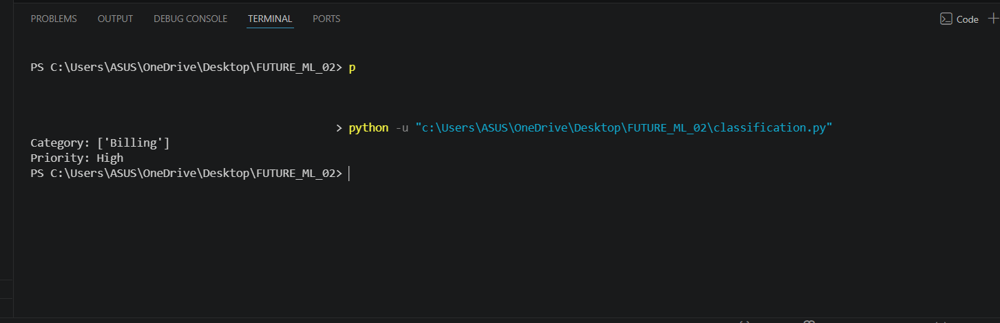

# 📌 Support Ticket Classification (Task 2)

## 🔹 Objective

The goal of this project is to build a Machine Learning model that can automatically classify customer support tickets into categories and assign priority levels.

---

## 🛠️ Tools & Technologies

* Python
* Pandas
* Scikit-learn
* CountVectorizer
* Multinomial Naive Bayes

---

## 📂 Dataset

A simple dataset (`tickets.csv`) is used with the following columns:

* **Text** → Customer issue
* **Category** → Type of problem (Billing / Technical)

### Example:

* "payment failed" → Billing
* "login issue" → Technical

---

## ⚙️ Steps Performed

1. Loaded dataset using Pandas
2. Converted text into numerical form using CountVectorizer
3. Trained model using Naive Bayes algorithm
4. Predicted category for new input text
5. Implemented priority logic (High / Medium / Low)

---

## ▶️ How It Works

### Input:

```
payment issue
```

### Output:

```
Category: Billing
Priority: Medium
```

---

## 📊 Output

The model successfully classifies support tickets and assigns priority based on keywords.

(Add your screenshot here 👇)



---

## 📁 Project Structure

```
FUTURE_ML_02/
│
├── classification.py
├── tickets.csv
├── screenshot.png
└── README.md
```

---

## 🚀 Conclusion

This project demonstrates how Machine Learning can be used to automate customer support by classifying tickets and prioritizing them efficiently.

---
