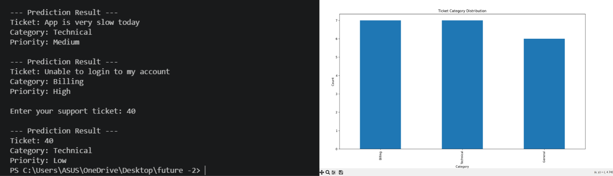

# 📌 Support Ticket Classification System (Task 2)

## 🚀 Project Overview

This project is a Machine Learning-based system that automatically classifies customer support tickets into categories and assigns priority levels.
It helps support teams respond faster and manage issues efficiently.

---

## 🎯 Objectives

* Classify support tickets into categories:

  * **Billing**
  * **Technical**
  * **General**
* Assign priority levels:

  * **High**
  * **Medium**
  * **Low**

---

## 🛠️ Technologies Used

* Python 🐍
* Pandas
* Scikit-learn
* Matplotlib
* Regular Expressions (re)

---

## ⚙️ Features

* ✔ Text preprocessing and cleaning
* ✔ TF-IDF feature extraction
* ✔ Machine Learning classification model
* ✔ Priority prediction using rule-based logic
* ✔ Interactive user input system
* ✔ Data visualization (bar chart)

---

## 📊 Model Used

* Logistic Regression (for ticket classification)

---

## 🧠 How It Works

1. Input ticket text
2. Clean and preprocess the text
3. Convert text into numerical features using TF-IDF
4. Predict ticket category using ML model
5. Assign priority based on keywords

---

## 🖥️ Example Output

```
--- Prediction Result ---
Ticket: App is very slow today
Category: Technical
Priority: Medium
```

---

## 📷 Output Screenshot



---

## ▶️ How to Run the Project

### 1️⃣ Install dependencies

```
pip install pandas scikit-learn matplotlib
```

### 2️⃣ Run the program

```
python ticket_classification.py
```

### 3️⃣ Enter your ticket

```
Enter your support ticket: Payment failed
```

---

## 📁 Project Structure

```
FUTURE_ML_02/
│── ticket_classification.py
│── README.md
│── output.png
```

---

## 📌 Key Learnings

* Natural Language Processing basics
* Text classification techniques
* Machine Learning model training
* Data preprocessing and feature engineering

---

## 🔥 Future Improvements

* Use larger real-world datasets
* Improve model accuracy
* Add GUI (Web/App interface)
* Deploy as a web application

---

## 👤 Author

* Gangala chetan vamsi

---

## 📢 Internship

This project is submitted as part of the **Machine Learning Internship (Task 2)**.

---
